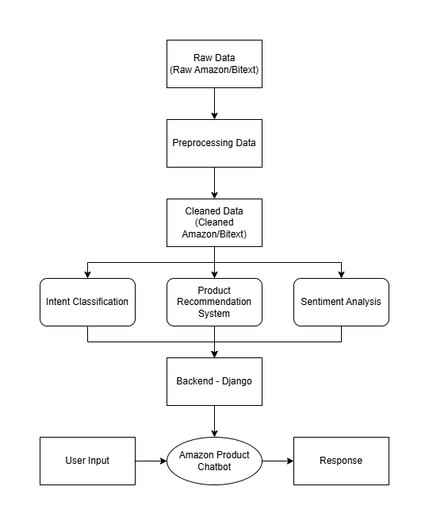
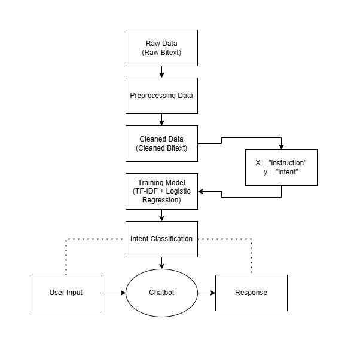
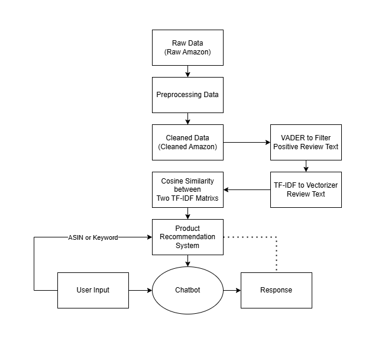
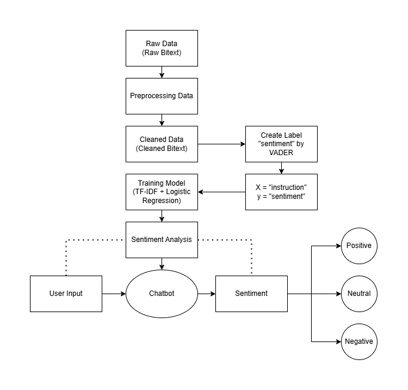
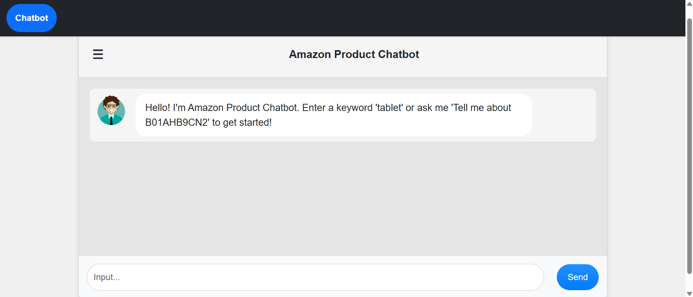
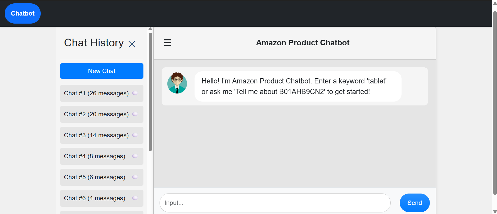
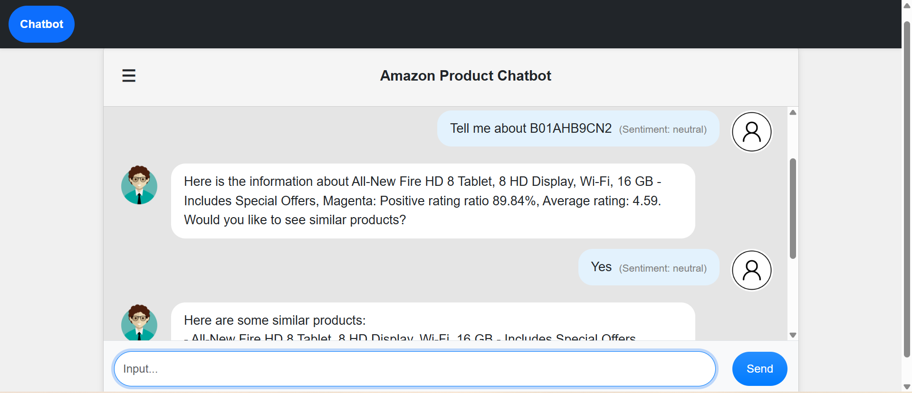
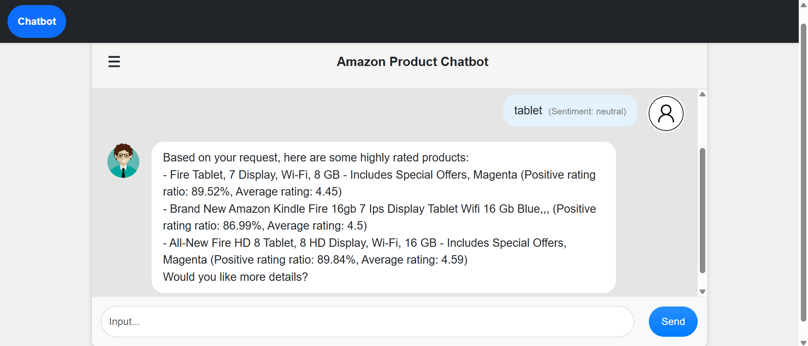
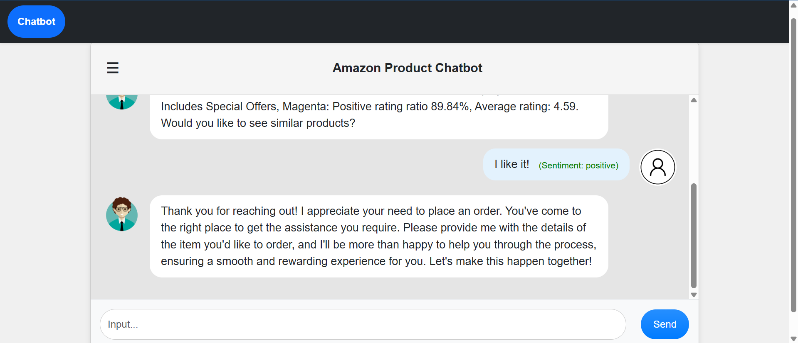

<h1 align="center">
Amazon Product Chatbot
</h1>

<p align="center" style="color:gray;">
(Chatbot tư vấn sản phẩm Amazon)
</p>

<hr>

## MỤC LỤC

- [GIỚI THIỆU TỔNG QUÁT](#giới-thiệu-tổng-quát)
- [BỘ DỮ LIỆU](#bộ-dữ-liệu)
- [CẤU TRÚC MÃ NGUỒN](#cấu-trúc-mã-nguồn)
- [CÔNG NGHỆ TIÊU BIỂU](#công-nghệ-tiêu-biểu)
- [KHỞI ĐỘNG DỰ ÁN](#khởi-động-dự-án)
- [MỘT SỐ HÌNH ẢNH](#một-số-hình-ảnh)

## GIỚI THIỆU TỔNG QUÁT

Đây là dự án xây dựng một **Web App có tích hợp Chatbot**, hỗ trợ người sử dụng các chức năng như:

Bước đầu tiên của dự án là **tiền xử lý dữ liệu** hai tập dữ liệu về **Amazon** và **Bitext**, được thực hiện trên Kaggle để dễ dàng tương tác, và chỉ giữ lại những thuộc tính quan trọng. Từ đây, tải những tập dữ liệu này về và bắt đầu xây dựng ba Module quan trọng của dự án:

1. **Intent Classification:** Nhận diện ý định từ yêu cầu của người dùng.

2. **Product Recommendation System:** Gợi ý sản phẩm dựa trên `ASIN` (mã sản phẩm) hoặc từ khoá (Keyword).

3. **Sentiment Analysis**: Phân tích cảm xúc từ dữ liệu đầu vào của người dùng.

Sau khi đã thực hiện ba Module trên, đóng gói những dữ liệu quan trọng để tái sử dụng trong Django Backend. Ta sẽ xây dựng nhiều tầng chức năng:

1. Tầng **Model** để lưu trữ lịch sử các đoạn hội thoại.
2. Tầng **Service** để đưa ba Module vào Chatbot bằng nhiều Logic khác nhau
3. Tầng **View** để nhận dữ liệu người dùng, Chatbot xử lý dữ liệu từ nhờ tầng Service, rồi đưa ra câu trả lời.
4. Tầng **Template** để hiển thị giao diện tương tác với người dùng.

## BỘ DỮ LIỆU

Đường dẫn Dataset Amazon: https://www.kaggle.com/datasets/datafiniti/consumer-reviews-of-amazon-products<br>
Đường dẫn Dataset Bitext: https://www.kaggle.com/datasets/bitext/bitext-gen-ai-chatbot-customer-support-dataset

Tập dữ liệu đầu tiên của dự án này có tên là **Amazon**, chứa những đánh giá của người dùng về các sản phẩm trên Amazon. Tập dữ liệu này được sử dụng để trích xuất thông tin về chất lượng sản phẩm, bao gồm tỷ lệ đánh giá tích cực, điểm đánh giá trung bình và các thuộc tính mô tả sản phẩm. Ngoài ra, dữ liệu còn đóng vai trò làm cơ sở cho hệ thống gợi ý sản phẩm dựa trên từ khoá và mức độ hài lòng của người dùng.

Tập dữ liệu thứ hai của dự án này có tên là **Bitext**, chứa các cặp câu hội thoại và nhãn ý định (Intent) liên quan đến hỗ trợ khách hàng. Tập dữ liệu này được sử dụng để huấn luyện mô hình phân loại ý định, giúp Chatbot nhận biết các yêu cầu chung của người dùng như chào hỏi, trợ giúp, hỏi thông tin, phản hồi tiêu cực hoặc các tình huống hội thoại không liên quan trực tiếp đến sản phẩm.

Việc kết hợp hai tập dữ liệu **Amazon** và **Bitext** cho phép Chatbot vừa có khả năng tư vấn và gợi ý sản phẩm, vừa duy trì được tương tác hội thoại tự nhiên, phù hợp với các kịch bản hỗ trợ khách hàng trong môi trường thương mại điện tử.

## CẤU TRÚC MÃ NGUỒN

[backend](backend/) : Chứa mã nguồn của Backend Django.<br>
[data](data/) : Chứa các tập dữ liệu sạch.<br>
[model](model/) : Chứa mô hình và các thành phần được đóng gói.<br>
[notebook](notebook/) : Chứa các Notebook tiền xử lý dữ liệu và huấn luyện mô hình.<br>
[picture](picture/) : Chứa danh mục hình ảnh.

## CÔNG NGHỆ TIÊU BIỂU

Một số công nghệ được áp dụng trong dự án: Python, Django, Scikit-learn, NLTK, spaCy, Pandas, NumPy, SQLite,
HTML, CSS, JavaScript, Bootstrap

## KHỞI ĐỘNG DỰ ÁN

1. Mở thư mục dự án, sau đó vào phần Terminal
2. Đi vào thư mục Backend:

```
cd backend
```

2. Nhập câu lệnh sau để chạy chương trình:

```
python manage.py runserver
```

3. Truy cập ứng dụng tại đường dẫn:

```
http://127.0.0.1:8000/
```

4. Thử nghiệm Chatbot với Test Case được minh hoạ trên **[MỘT SỐ HÌNH ẢNH](#một-số-hình-ảnh)**

## MỘT SỐ HÌNH ẢNH

<p align="center">
  
</p>

<p align="center"><i>Pipeline tổng thể của dự án.</i></p>

<br>

<p align="center">
  
</p>

<p align="center"><i>Pipeline của Intent Classification.</i></p>

<br>

<p align="center">
  
</p>

<p align="center"><i>Pipeline của Product Recommendation System.</i></p>

<br>

<p align="center">
  
</p>

<p align="center"><i>Pipeline của Sentiment Analysis.</i></p>

<br>

<p align="center">
  
</p>

<p align="center"><i>Giao diện của dự án.</i></p>

<br>

<p align="center">
  
</p>

<p align="center"><i>Lịch sử trò chuyện trên giao diện.</i></p>

<br>

<p align="center">
  
</p>

<p align="center"><i>Kết quả khi nhập mã sản phẩm trên giao diện.</i></p>

<br>

<p align="center">
  
</p>

<p align="center"><i>Kết quả khi nhập từ khoá trên giao diện.</i></p>

<br>

<p align="center">
  
</p>

<p align="center"><i>Kết quả nhận diện cảm xúc trên giao diện.</i></p>
